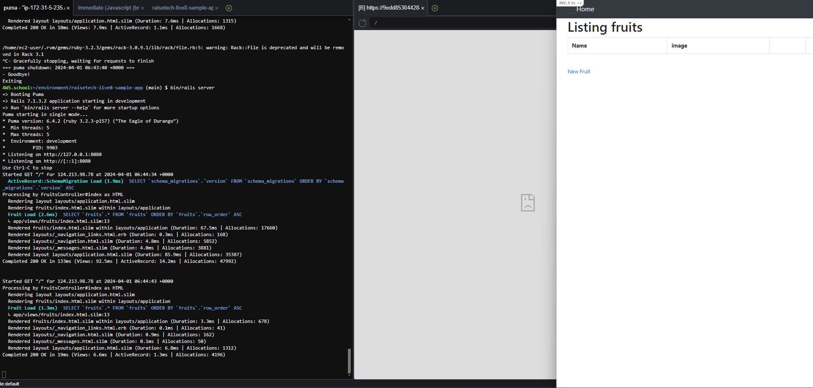

# 課題3

## 1.APサーバーについて
### APサーバーの名前とバージョン
- APサーバー名：Puma  
-プーマバージョン: 6.4.2  

### APサーバーを終了させた場合、引き続きアクセスできるのか
- A.出来ない  
  

再起動  

###

## 2. DBサーバーについて  
###  DB サーバー
-   DBサーバー（DBエンジン）名: mysql
-   mysql：Ver 8.0.36  
  

### DBサーバーを終了させた場合、引き続きアクセスできるのか
A.出来ない  
  

### Railsの構成管理ツール
構成管理ツールはBundlerでした。
  

### 感想
手順通り行っても何かしらのエラーが発生することが分かった。
ターミナルやブラウザのエラーから何をすればいいかを判断する必要がある。
ブラウザの正しい表示に苦戦をしたが、切り分けて問題を考えるといいということが分かった。