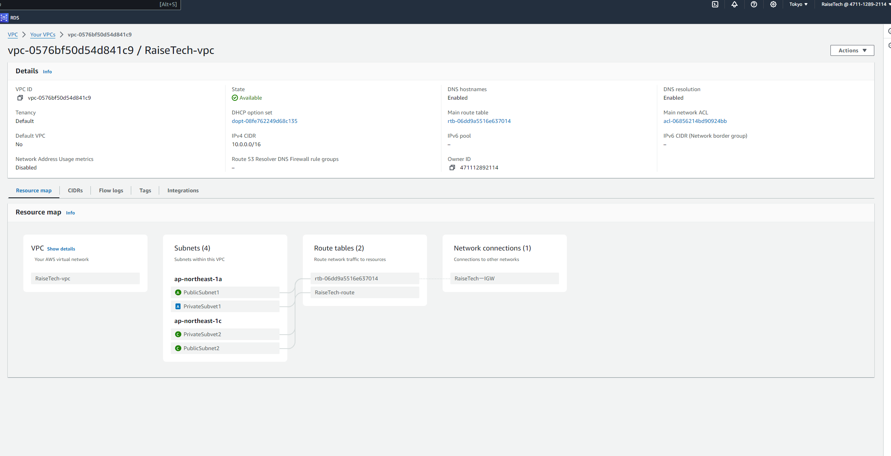
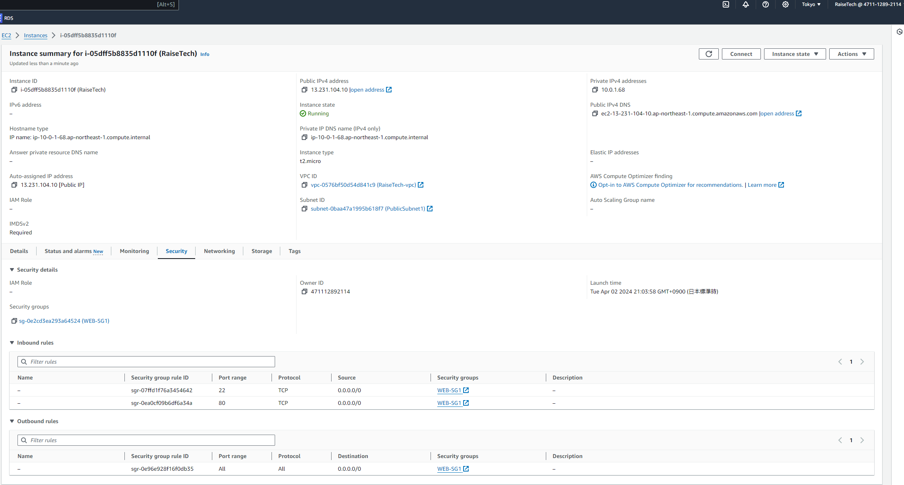
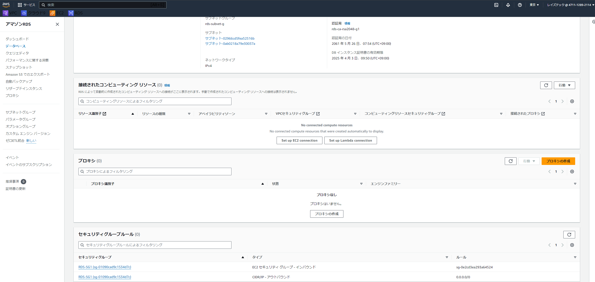
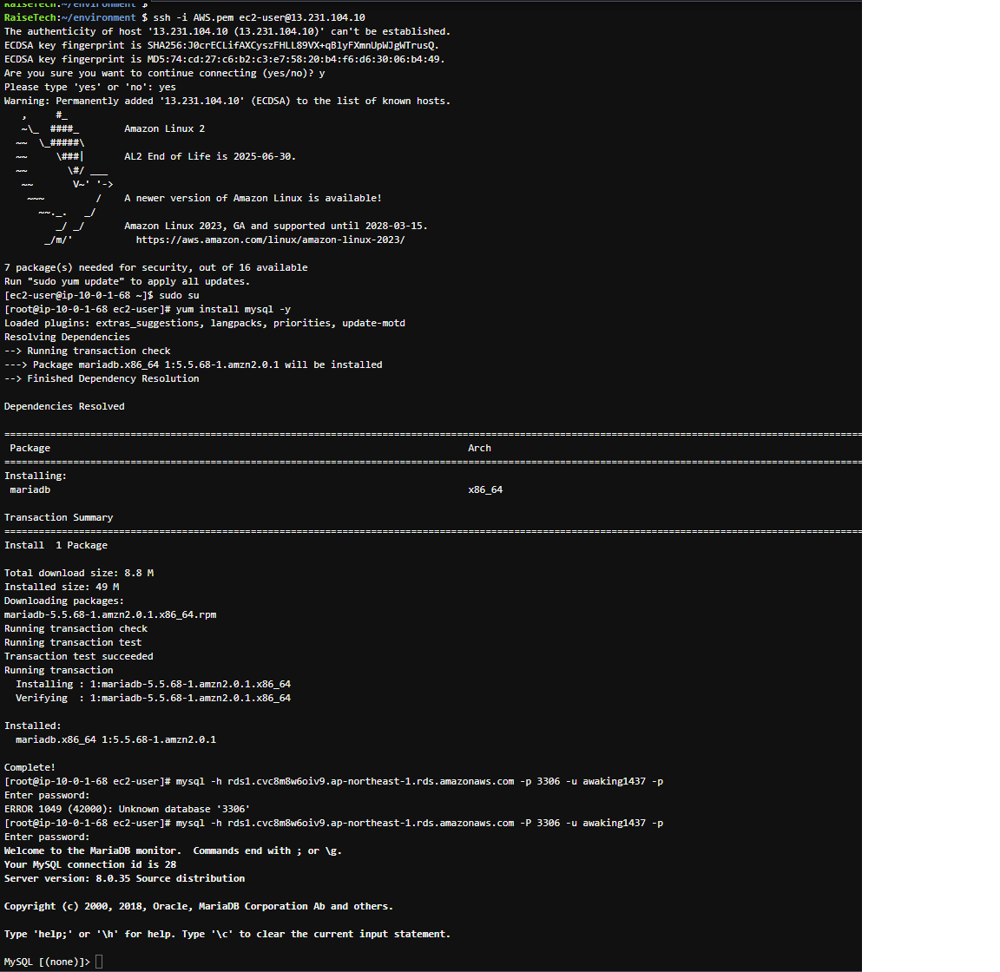

### 課題04

# VPCの作成

# EC2のセキュリティグループの設定

# RDSのセキュリティグループの設定

# EC2からRDS接続

# 感想
作業していく際は1つ1つ図にして作業していくとわかりやすいと思った。
RDSはAZにまたがってサブネットグループを作成する必要がある。
セキュリティグループは、トラフィックの拒否許可ができる。
この機能によりセキュリティ面が安全になる。
