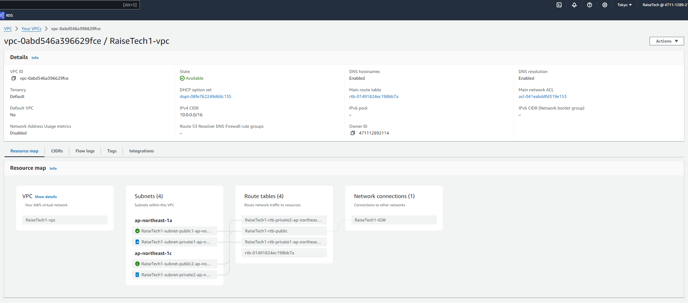
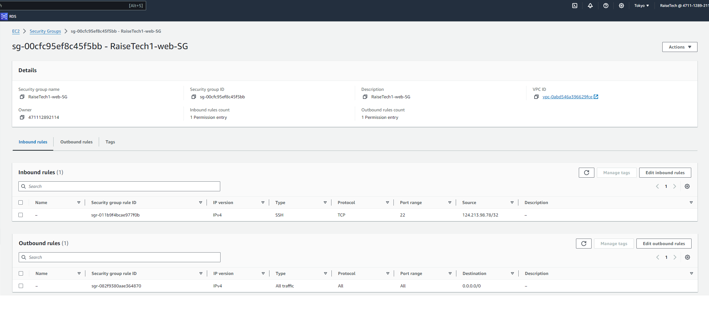
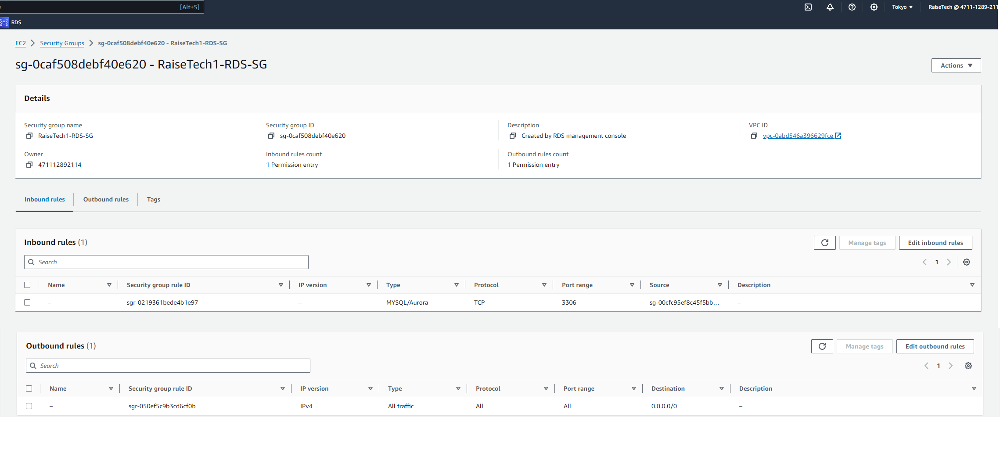
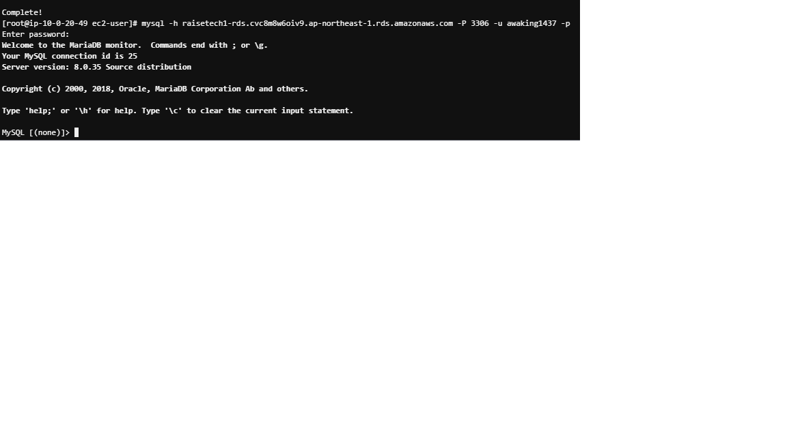

# 課題04

## VPCの作成

##C2のセキュリティグループの設定

## RDSのセキュリティグループの設定

## EC2からRDS接続

## 感想
作業していく際は1つ1つ図にして作業していくとわかりやすいと思った。
RDSはAZにまたがってサブネットグループを作成する必要がある。
セキュリティグループは、トラフィックの拒否許可ができる。
この機能によりセキュリティ面が安全になる。
